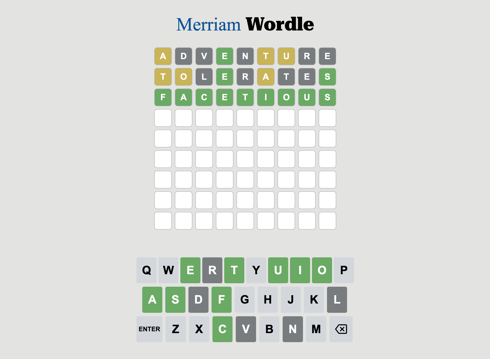

# Overview

When the viral word game, "Wordle" came out, I was immediately hooked on it. I played every day and shared daily results with family and friends. After a couple of months, I fell out of habit and stopped playing every day. After seeing the "Word of the Day" widget on my phone every day, I had the idea to create Wordle from scratch and use Merriam-Webster's word of the day as the Wordle word of the day. This would introduce a significant level of complexity and challenge to the game, as the word's length will vary daily, often exceeding 5 letters.

I then set out to create the game knowing that it would put my HTML/CSS and JavaScript skills to the test. Prior to this project, I had not used APIs which intimidated me. I was unable to find the API documentation that I required from Merriam-Webster, so I used JavaScript's Fetch API to get the datum that I needed. This project pushed me to create a single dynamic web page in which users can enjoy their time.

<!-- [Software Demo Video](https://www.youtube.com/watch?v=E6-IoybbV74) -->

# Development Environment

IDE: Visual Studio Code

Languages: HTML, CSS, JavaScript

# Useful Websites

- [W3 Schools](https://www.w3schools.com)
- [YouTube](https://www.youtube.com)
- [Stack Overflow](https://stackoverflow.com)
- [APIs for Librarians](https://www.apis4librarians.com/wordnik/word-of-the-day)
- [oxylabs](https://oxylabs.io/blog/playwright-web-scraping)

# Future Work

- Provide users with the option to choose the source of the Word of the Day.
- Accept keyboard input, so you don't have to touch or click on the keyboard on the screen.
- Create a pop-up for when you guess the word. This pop-up could congratulate you and share the definition of the word.  